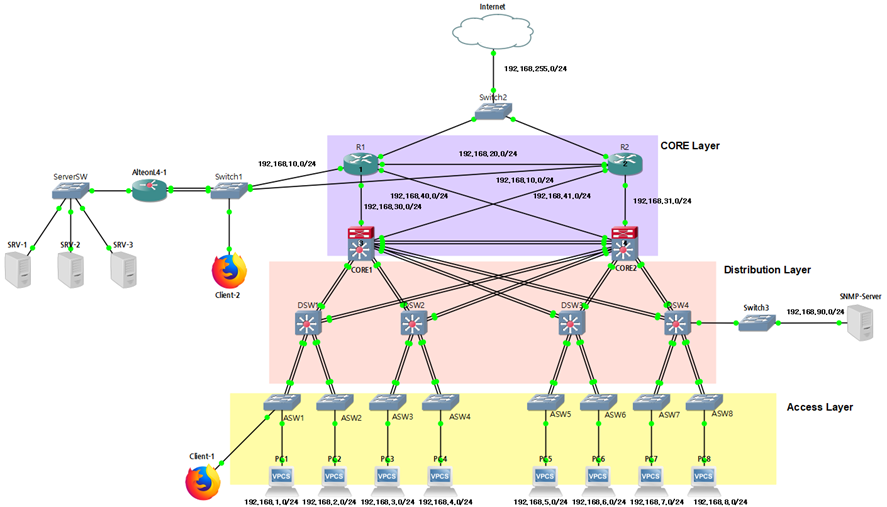
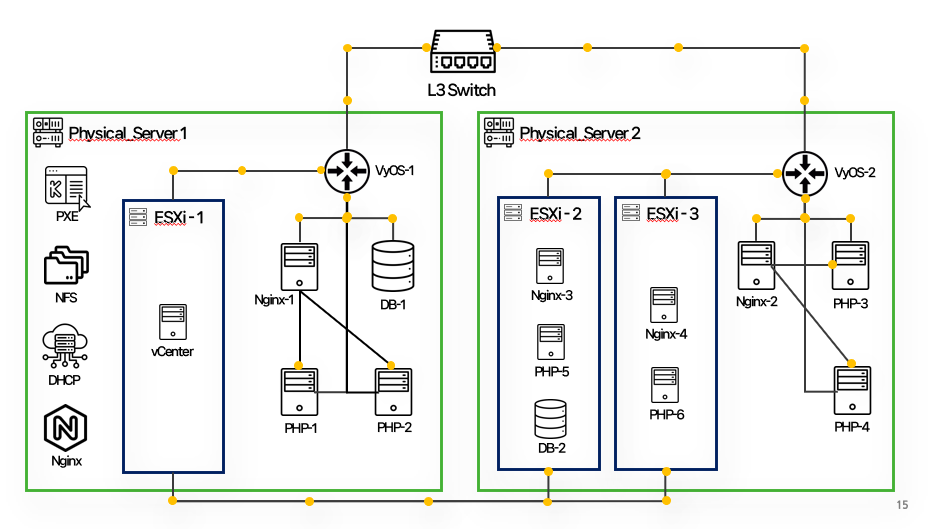

📜 Haknam Kim's Projects
===

(1) 3-Tier Network 및 Zabbix를 활용한 모니터링 시스템 구축
---

### 👨‍💼 기획 및 구축   
김학남

### 🔖 분류   
개인 프로젝트

### 📆 제작 기간   
2023.05.29 ~ 2023.06.05

### ⏰ 진행순서    
요구 분석 ➡ 토폴로지 설계 ➡ 네트워크 구축 ➡ NMS 설계 및 구축 ➡ 테스트 및 오류 수정

### 🛠 사용기술 및 장비    
  GNS3, VMware, Rocky Linux, Nginx, PHP, MariaDB, Zabbix(SNMP), Cisco Router, Cisco L3/L2 Switch, Alteon L4 Switch

### 👨🏻‍💻 핵심 구현 기능
#### * CISCO 장비를 사용하여 3 Tier Network 구축
1. VLAN과 서브넷팅을 이용하여 부서별로 네트워크 분리
2. 서버와 사용자 네트워크 망 분리 
3. ALTEON L4 switch를 사용하여 Load Balancing 환경 구축 (가용성)
4. Zabbix Server를 사용하여 네트워크 모니터링 환경 구축
5. 이중화 구조 디자인 및 서비스 장애 방지
6. 인증되지 않은 장비 제어

🔗 [**프로젝트 상세 설명 참고**](https://github.com/Hakunam97/Projects/tree/main/01.%203-Tier%20Network%20%EB%B0%8F%20Zabbix%EB%A5%BC%20%ED%99%9C%EC%9A%A9%ED%95%9C%20%EB%AA%A8%EB%8B%88%ED%84%B0%EB%A7%81%20%EC%8B%9C%EC%8A%A4%ED%85%9C%20%EA%B5%AC%EC%B6%95)

- - -

(2) KVM 가상화 환경 구축 및 관리
---

### 👨‍💼 기획 및 구축   
A조 (김학남, 박무진, 김지영)

### 🔖 분류   
팀 프로젝트

### 📆 제작 기간   
2023.06.22 ~ 2023.07.14

### ⏰ 진행순서    
요구 분석 ➡ 토폴로지 설계 ➡ 서버 구축 ➡ 서버 테스트 및 연동 ➡ 서버 운영

### 🛠 사용기술 및 장비    
Cisco Router, Cisco L3 Switch, DL360 Server, Rocky Linux, KVM, VyOS, Nginx, MariaDB, PHP, vSphere, MobaXterm

### 👨🏻‍💻 핵심 구현 기능
#### * Switch, Router 구축
1. RSTP, Portfast 적용으로 빠른 Spanning-Tree 수렴
2. LACP active를 이용한 포트 통합
3. BPDU guard를 이용한 Root 스위치 변경 방지
4. BPDU filter를 이용해 불필요한 BPDU 전송 방지
5. OSPF를 활용한 동적 라우팅 및 네트워크 안정성 구축
6. NAT를 활용한 사설 IP 대역과 ISP 망 송수신 및 Port forwarding

#### * Web server, Ovirt 구축
1. Web, PHP, DB 서버를 구분하여 트래픽 부하 분산
2. Ovirt를 이용해 가상화 관리 플랫폼 구축
3. PXE, Kickstart를 활용해 간결한 가상머신 생성

🔗 프로젝트 상세 설명 참고