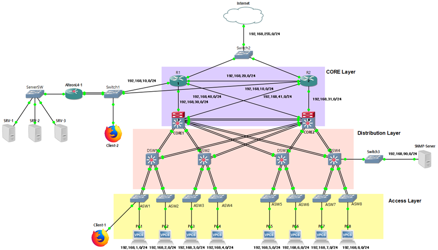
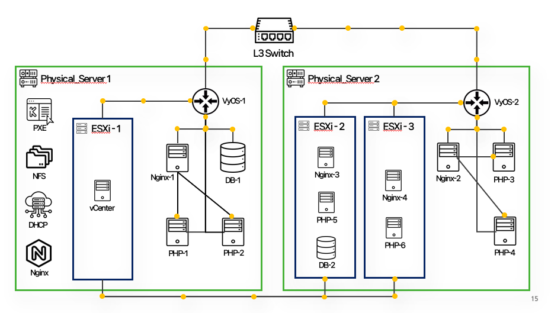
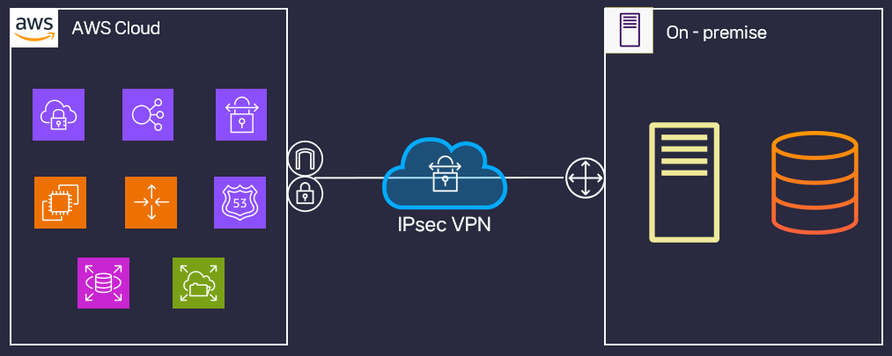

📜 Haknam Kim's Projects
===

(1) 3-Tier Network 및 Zabbix를 활용한 모니터링 시스템 구축
---

### 👨‍💼 기획 및 구축   
김학남

### 🔖 분류   
개인 프로젝트

### 📆 제작 기간   
2023.05.29 ~ 2023.06.05

### ⏰ 진행순서    
요구 분석 ➡ 토폴로지 설계 ➡ 네트워크 구축 ➡ NMS 설계 및 구축 ➡ 테스트 및 오류 수정

### 🛠 사용기술 및 장비    
  GNS3, VMware, Rocky Linux, Nginx, PHP, MariaDB, Zabbix(SNMP), Cisco Router, Cisco L3/L2 Switch, Alteon L4 Switch

### 👨🏻‍💻 핵심 구현 기능
#### * CISCO 장비를 사용하여 3 Tier Network 구축
1. VLAN과 서브넷팅을 이용하여 부서별로 네트워크 분리
2. 서버와 사용자 네트워크 망 분리 
3. ALTEON L4 switch를 사용하여 Load Balancing 환경 구축 (가용성)
4. Zabbix Server를 사용하여 네트워크 모니터링 환경 구축
5. 이중화 구조 디자인 및 서비스 장애 방지
6. 인증되지 않은 장비 제어

🔗[**프로젝트 상세 설명 참고**](https://github.com/Hakunam97/Projects/tree/main/01.%203-Tier%20Network%20%EB%B0%8F%20Zabbix%EB%A5%BC%20%ED%99%9C%EC%9A%A9%ED%95%9C%20%EB%AA%A8%EB%8B%88%ED%84%B0%EB%A7%81%20%EC%8B%9C%EC%8A%A4%ED%85%9C%20%EA%B5%AC%EC%B6%95)

- - -

(2) KVM 가상화 환경 구축 및 관리
---

### 👨‍💼 기획 및 구축   
A조 (김학남, 박무진, 김지영)

### 🔖 분류   
팀 프로젝트

### 📆 제작 기간   
2023.06.22 ~ 2023.07.14

### ⏰ 진행순서    
요구 분석 ➡ 토폴로지 설계 ➡ 서버 구축 ➡ 서버 테스트 및 연동 ➡ 서버 운영

### 🛠 사용기술 및 장비    
Cisco Router, Cisco L3 Switch, DL360 Server, Rocky Linux, KVM, VyOS, Nginx, MariaDB, PHP, vSphere, MobaXterm

### 👨🏻‍💻 핵심 구현 기능
#### * Switch, Router 구축
1. RSTP, Portfast 적용으로 빠른 Spanning-Tree 수렴
2. LACP active를 이용한 포트 통합
3. BPDU guard를 이용한 Root 스위치 변경 방지
4. BPDU filter를 이용해 불필요한 BPDU 전송 방지
5. OSPF를 활용한 동적 라우팅 및 네트워크 안정성 구축
6. NAT를 활용한 사설 IP 대역과 ISP 망 송수신 및 Port forwarding

#### * Web server, Ovirt 구축
1. Web, PHP, DB 서버를 구분하여 트래픽 부하 분산
2. Ovirt를 이용해 가상화 관리 플랫폼 구축
3. PXE, Kickstart를 활용해 간결한 가상머신 생성

🔗[**프로젝트 상세 설명 참고**](https://github.com/Hakunam97/Projects/tree/main/02.%20KVM_%EA%B0%80%EC%83%81%ED%99%94_%ED%99%98%EA%B2%BD_%EA%B5%AC%EC%B6%95_%EB%B0%8F_%EA%B4%80%EB%A6%AC)

(3) VPN을 활용한 하이브리드 클라우드 구축
---

### 👨‍💼 기획 및 구축   
D조 (김학남, 서희경, 김경태)

### 🔖 분류   
팀 프로젝트

### 📆 제작 기간   
2023.08.21 ~ 2023.10.04

### ⏰ 진행순서    
요구 분석 ➡ 토폴로지 설계 ➡ AWS, 온프레미스 구축 ➡ 웹 서비스 테스트 ➡ 하이브리드 클라우드 연동 ➡ 웹 서비스 운영

### 🛠 사용기술 및 장비    
Rocky Linux, Nginx, MariaDB, PHP, MobaXterm, VMware, FRRouting, Gabia, Cloudflare, AWS, Docker, Docker compose, Kubernetes

### 👨🏻‍💻 핵심 구현 기능
#### * AWS 인프라 구축
1. 가용영역 이중화 및 Public/Private Subnet 구분으로 가용성과 보안성 확보
2. Route 53으로 DNS 서비스를 구축하여 사용자의 접근 편의성 확보
3. Auto Scaling을 위해 EFS를 활용하여 탄력적인 공유 파일 시스템 구축
4. RDS를 활용해 관계형 데이터베이스 구축
5. Loadbalancing을 활용해 부하 분산 및 가용성 확보
6. Auto Scaling을 활용해 트래픽 급증에 대비한 탄력적인 인프라 구축

#### * K8s 인프라 구축
1. Pod으로 컨테이너 관리
2. Replicaset으로 Pod의 개수 보장
3. Deployment로 버전 관리
4. YAML 파일로 컨테이너 오케스트레이션 및 배포 자동화, 무중단 배포

#### * IPsec VPN 구축
1. AWS와 K8s 환경 간의 VPN 터널링 구축하여 연결
2. IPsec 설정으로 VPN 보안 강화
3. Site-to-Site IPsec VPN

🔗[**프로젝트 상세 설명 참고**](https://github.com/Hakunam97/Projects/tree/main/03.%20VPN_%ED%95%98%EC%9D%B4%EB%B8%8C%EB%A6%AC%EB%93%9C_%ED%81%B4%EB%9D%BC%EC%9A%B0%EB%93%9C_%EA%B5%AC%EC%B6%95)